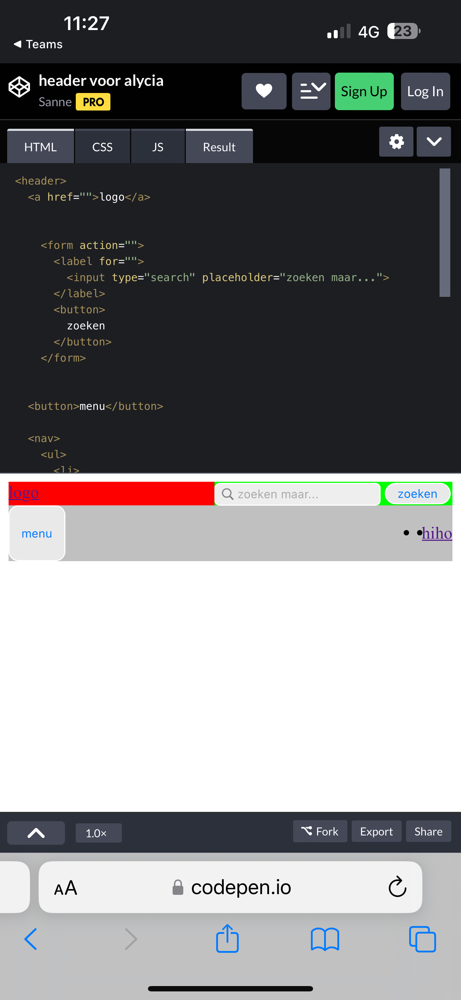
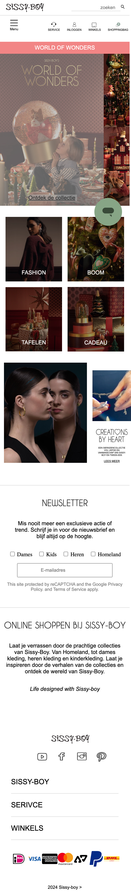
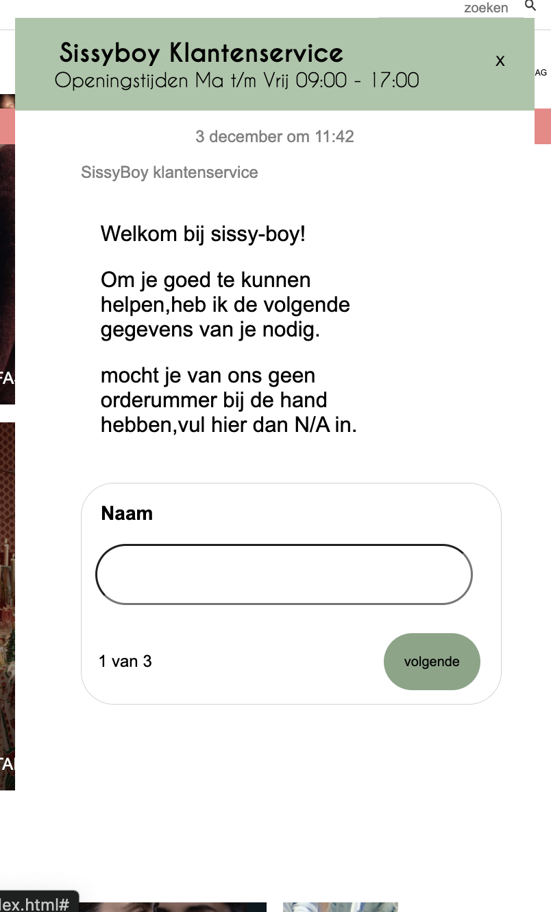
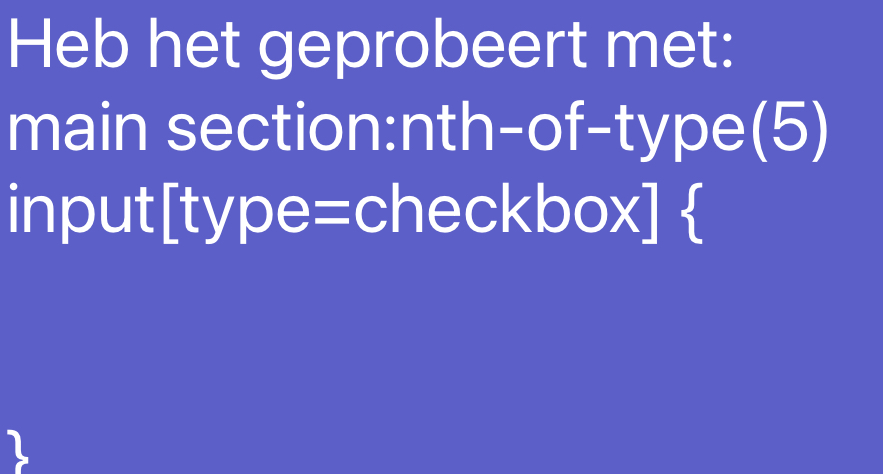

# Procesverslag
Markdown is een simpele manier om HTML te schrijven.  
Markdown cheat cheet: [Hulp bij het schrijven van Markdown](https://github.com/adam-p/markdown-here/wiki/Markdown-Cheatsheet).

Nb. De standaardstructuur en de spartaanse opmaak van de README.md zijn helemaal prima. Het gaat om de inhoud van je procesverslag. Besteedt de tijd voor pracht en praal aan je website.

Nb. Door *open* toe te voegen aan een *details* element kun je deze standaard open zetten. Fijn om dat steeds voor de relevante stuk(ken) te doen.

## Jij

  
uitwerken voor kick-off werkgroep

  ### Auteur:
  Alycia

  #### Je startniveau:
  rood

  #### Je focus:
  Responsive
 

## Je website

  
uitwerken voor kick-off werkgroep

  ### Je opdracht:
  link: https://www.sissy-boy.com/?_gl=1*1auuxup*_up*MQ..&gclid=EAIaIQobChMI0MimxKLpiQMV3hyDAx2t8C9JEAAYASAAEgL7tvD_BwE 

  #### Screenshot(s) van de eerste pagina (small screen): 
  Sissy boy - home page 
  link: https://www.sissy-boy.com 

  #### Screenshot(s) van de tweede pagina (small screen):
  Sissy boy - kerst decoratie (tafelen) 
 
  Nu veranderd naar de pagina: 
  Sissy-boy - Homeland 
  link: https://www.sissy-boy.com/homeland-landing/

## Toegankelijkheidstest 1/2 (week 1)

  
uitwerken na test in 2e werkgroep

  ### Bevindingen
  Lijst met je bevindingen die in de test naar voren kwamen:

  Ze gebruiken engels en Nederlandse taal door elkaar, wat erg storend is. Ook is er weinig verschil tussen 'normale' tekst en buttons/links. Hierdoor is de website niet overzichtelijk en moeilijk te begrijpen voor een gebruiker. 

  Qua screen reader gaan ze een logische volgorde langs, zodat het makkelijk te volgen is. Helaas kan je niet doorspoelen naar verdere onderdelen op de pagaina's en en miste transscriptie. 

## Breakdownschets (week 1)

  
uitwerken na afloop 3e werkgroep

  ### de hele pagina: 
  

  ### dynamisch deel (bijv menu): 
  

  ### wellicht nog een dynamisch deel (bijv filter): 
  
 
 Breakdown 2e pagina 
 

## Voortgang 1 (week 2)

  
uitwerken voor 1e voortgang

  ### Stand van zaken
  hier dit ging goed & dit was lastig (neem ook screenshots op van delen van je website en code)

  ### Agenda voor meeting
  samen met je groepje opstellen

 Joshua
 - Wanneer nieuwe section beginnen? 
 - Tekst selecteren met toetsenbord of met iets anders?
 - Wanneer grid, wanneer flexbox?
 - Breakdown schets na laten kijken.

 Alycia
 - Hoe krijg ik tekst op mijn image?
 - Wanneer grid, wanneer flexbox?
 - Breakdown schets na laten kijken.

 Julian 
 - Wat wordt er precies verwacht van ons qua toegangkelijkheids bald van de vorige keer?
 - Minimaal 3 css?
 - Functies binnen de website? (surface plane)

  
  ### Verslag van meeting
  hier na afloop snel de uitkomsten van de meeting vastleggen

  - punt 1 : We hebben eigenlijk gekeken naar de html structuur van mijn eerst pagina. Hier heb is het voor mij duidelijker geworden, wat nou bij elkaar in section horen en welke hoe ik die elementen moet aanroepen. 

  - punt 2 : Het is duidelijk geworden dat je zelf mag kiezen of je grid of flexbox wilt gebruiken. Beide zijn goed. 

  - a'tje kunnen ook in de li.
  - Wanneer ik een ul en li kan gebruiken.

## Voortgang 2 (week 3)

  
uitwerken voor 2e voortgang

  ### Stand van zaken
  hier dit ging goed & dit was lastig (neem ook screenshots op van delen van je website en code)

  ### Agenda voor meeting
  samen met je groepje opstellen (ik heb hier meegedaan met een ander groepje)

 Luna 
 - Hoe krijg ik mijn tekst goed op mijn img in de grid?
 - Light en dark modus laten zien.
 - Laten zien waar je trots op bent. 

 Iris 
 - Hoe krijg ik de quotes goet responsive 
 - Hoe werkt het grid nou goed?
 - Laten zien waar je torts op bent.

 Alycia 
 - Hoe krijg ik mijn header responsive? 
 - Hoe krijg ik mijn hamburgermenu werkend? 
 - Mijn werk in het algemeen laten zien. 

  ### Verslag van meeting
  hier na afloop snel de uitkomsten van de meeting vastleggen

  - punt 1 : Ik kwam erachter dat ik helemaal geen section in de header mag gebruiken, terwijl de assisent studenten, nog mee hadden gekeken naar mijn breakdown schets. Dat was wel even balen, maar gelukkig kwam Sanne daar met een oplossing. Al ging het best snel en vond ik het moeilijk te begrijpen. Ik wilde eigenlijk vragen hoe ik een hamburger menu moest maken, maar omdat hij dit als een grote fout zag heb ik eerts dit goed moeten maken. Hierdoor ging ik voor mijn gevoel weer 2 stappen achteruit. 

  

      - Ik heb dit overigens thuis geprobeerd, maar ik kwam er echt niet uit. 

  - punt 2 : ben erachter gekomen dat ik toch best goed weet hoe grid in elkaar zit. IDt was fijn, omdat ik dit zelf ook nog verder meost toepassen in mijn andere pagina's. 

  - Je mag geen 
 in een button zetten! dat is niet netjes. 

## Toegankelijkheidstest 2/2 (week 4)

  
uitwerken na test in 9e werkgroep

  ### Bevindingen
  Lijst met je bevindingen die in de test naar voren kwamen (geef ook aan wat er verbeterd is):

## Voortgang 3 (week 4)

  
uitwerken voor 3e voortgang

  ### Stand van zaken
  hier dit ging goed & dit was lastig (neem ook screenshots op van delen van je website en code)

  ### Agenda voor meeting
  samen met je groepje opstellen (Ook hier heb ik meegedaan met een andere groep)

  Tom 
  - Hoezo werkt mijn video niet? 
  - Hoezo is mijn header niet responsive en gaat hij weg als ik het scherm verklein?

  Esmee
  - Ik wil de slider op een bepaalde manier opmaken, maar het lukt niet. 

  Alycia
  - Hoezo gaat mijn content over de balk heen? terwijl de balk een z-index heeft van 10 (exta hoog gedaan)?
  - Hoezo werkt mijn hamburger menu niet? 
  - Hoe moet ik een video erin zetten.

  ### Verslag van meeting
  hier na afloop snel de uitkomsten van de meeting vastleggen
  
  Ik vond het een vaag gesprek en vond de houding van de student assisenten niet fijn. Ik werd een beetje neer gezet alsog ik dom was, maar dat sloeg natuurlijk nergens op. Gewoon heel ongeinterseert, waardoor ik eigenlijk mijn vragen ook niet heb gestelt. 

  - punt 1 : over het algemeen was mijn code prima, ze snapte alleen soms niet wat ik had      gedaan, totdat ik het uitlegte. 

  - punt 2 : Ik moet -1 z-index gebruiken, zodat de balk weer over de content gaat.

  - punt 3 : Ik heb liever feedback van Sanne. 

## Eindgesprek (week 5)

  
uitwerken voor eindgesprek

  ### Je uitkomst - karakteristiek screenshots:
  
  

  ### Dit ging goed/Heb ik geleerd: 
  Korte omschrijving met plaatjes
  
  Ik heb veel geleerd tijdens de lessen. Ben uiteindelijk blij met wat ik allemaal heb kunnen maken in deze 5 weken. Ben eigenlijk trots op alles, want ik had nooit gedacht dat ik zoiets zou kunnen maken. Maar als ik iets moest kiezen is het dan de werkende chatbox. 
  

  Nu ik het grid geleerd heb, kan ik veel sneller werken en dat gaat mij zeker helpen in de toekomst. Ook ben ik verbaast wat je allemaal met css kunt doen, dus ook hier heb ik veel over geleerd. 

  ### Dit was lastig/Is niet gelukt:
  Korte omschrijving met plaatjes

  Dingen die mij niet zijn gelukt: 
  - Light en dark modus
  - Dropdowm menu bij een full screen 
  - Readme niet af kunnen maken
  - Header niet helemaal kloppend als hij op githup staat. 
  - checkbox kunnen stijlne 
  

## Bronnenlijst

  
continu bijhouden terwijl je werkt

  Nb. Wees specifiek ('css-tricks' als bron is bijv. niet specifiek genoeg). 
  Nb. ChatGpT en andere AI horen er ook bij.
  Nb. Vermeld de bronnen ook in je code.

  1. bron 1 : Sanne 
  2. bron 2 : Student assisenten 
  3. bron 3 : behandelde theorie in de les 
  4. bron 4 : Ik heb Chat.gpt gevraagd waarom bepaalde code niet werkt. Uiteindelijk heeft het mij niet verder gebracht en heb ik dit niet gebruikt in mijn code. 
  

